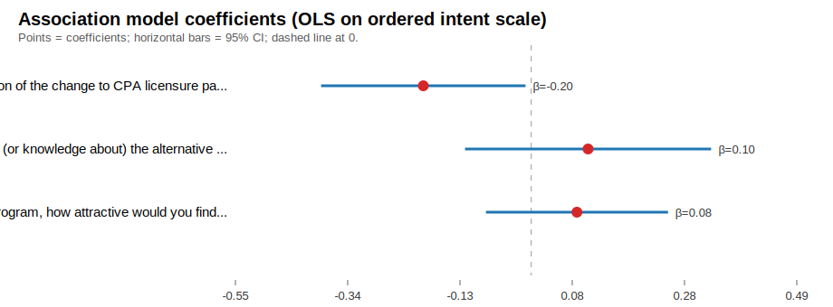

# Cross-sectional association analysis: CPA pathway perceptions and graduate enrollment intent

## Research question
How are students' perceptions of the CPA 150-credit-hour requirement and alternative-pathway framing associated with their **stated intent** to enroll in a graduate accounting program?

## Data and preprocessing
- Source file: `Alternative CPA Pathways Survey_December 31, 2025_09.45.csv` (Qualtrics export).
- Header handling: detected **3** metadata rows (QID row, question text row, ImportId JSON row), then respondent rows.
- Analytic sample filtering: retained completed + consented responses (`Finished=True`, `Q61=Yes`).
- Final respondent rows after filtering: **199**.

## Selected dependent variable (DV)
Programmatic scan selected **Q52** as the primary intent outcome based on keyword matches and ordered response scale suitability.

- **QID:** `Q52`
- **Question text:** How has the availability of (or knowledge about) the alternative pathway to CPA licensure impacted your desire to pursue a graduate degree (MAcc or MBA)?
- **Non-missing responses (filtered):** 145
- **Ordered coding used (low → high intent):**
  - 1: Significantly decreased desire
  - 2: Decreased desire
  - 3: No change in desire
  - 4: Increased desire
  - 5: Significantly increased desire

### DV distribution (descriptive)
- No change in desire: 64
- Decreased desire: 33
- Increased desire: 31
- Significantly decreased desire: 13
- Significantly increased desire: 4

## Selected perception predictors
Programmatic keyword scan over question text (`150`, `credit`, `hours`, `requirement`, `CPA`, `pathway`, `barrier`, `cost`, `time`) retained ordered-response items and selected up to three highest-scoring predictors.

- **Q6**: What is your overall perception of the change to CPA licensure pathways that creates an alternative pathway with fewer credit hours and an extra year of work experience?
- **Q51**: How has the availability of (or knowledge about) the alternative pathway to CPA licensure impacted your desire to pursue the CPA license?
- **Q25**: Instead of a full graduate program, how attractive would you find a shorter graduate certificate (total of three to four courses at graduate tuition rates)? This graduate certificate would focus on specialized accounting topics such as taxation, information systems, data analytics, or other areas that align with key domains of accounting expertise and the specialized sections of the CPA exam.

## Association model
Because the selected DV is an ordered 5-level intent/desire item, we estimate a **linear probability-style OLS on the ordered scale** (higher value = stronger graduate intent/desire). This is an association model, not a causal model.

- Complete-case N used in model: **145**
- R-squared: **0.035**

### Coefficients
| Term | Beta | Std. Error | z/t (normal approx) | p-value (approx) | 95% CI |
|---|---:|---:|---:|---:|---:|
| Intercept | 2.944 | 0.530 | 5.555 | 0.0000 | [1.905, 3.983] |
| Q6 | -0.199 | 0.096 | -2.070 | 0.0384 | [-0.388, -0.011] |
| Q51 | 0.105 | 0.116 | 0.905 | 0.3654 | [-0.122, 0.332] |
| Q25 | 0.084 | 0.086 | 0.984 | 0.3253 | [-0.084, 0.252] |

### Regression visual

## QID-to-text mapping for selected variables
| QID | ImportId | Question text |
|---|---|---|
| Q52 | QID52 | How has the availability of (or knowledge about) the alternative pathway to CPA licensure impacted your desire to pursue a graduate degree (MAcc or MBA)? |
| Q6 | QID6 | What is your overall perception of the change to CPA licensure pathways that creates an alternative pathway with fewer credit hours and an extra year of work experience? |
| Q51 | QID51 | How has the availability of (or knowledge about) the alternative pathway to CPA licensure impacted your desire to pursue the CPA license? |
| Q25 | QID25 | Instead of a full graduate program, how attractive would you find a shorter graduate certificate (total of three to four courses at graduate tuition rates)? This graduate certificate would focus on specialized accounting topics such as taxation, information systems, data analytics, or other areas that align with key domains of accounting expertise and the specialized sections of the CPA exam. |

## Limitations (important)
- This is **cross-sectional** survey data. Each respondent appears once, so results reflect contemporaneous relationships only.
- The outcome is **self-reported intent/desire**, not observed later enrollment behavior.
- Associations may reflect unmeasured differences across respondents (e.g., finances, prior work plans, program context), so coefficients should be interpreted as **related to / associated with**, not impacts or effects.
- The OLS-on-ordered-scale approach is pragmatic and reproducible here; an ordinal logit model could be used in richer statistical environments.
